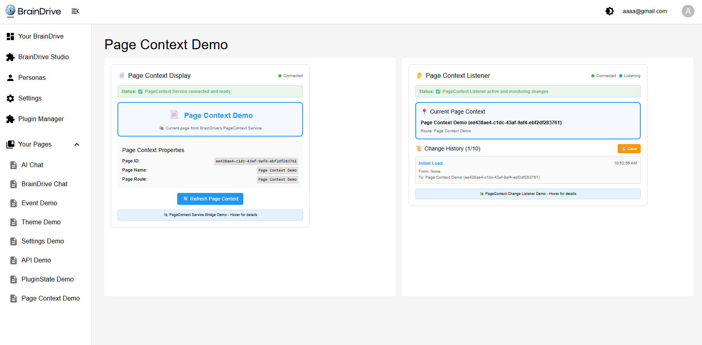

# ServiceExample_PageContext - BrainDrive PageContext Service Bridge Demo

A working demonstration plugin for BrainDrive's PageContext Service Bridge functionality. This plugin showcases real-time page context monitoring and information retrieval within the BrainDrive platform through two interactive components that display current page information and track page context changes.

## 📸 Plugin Demo



*The ServiceExample_PageContext plugin in action, showing real-time page context information and change monitoring through the PageContext Display and PageContext Listener modules.*

## 🎯 Purpose

This plugin serves as a **working demo** of BrainDrive's PageContext Service Bridge, demonstrating:
- How to retrieve current page context information (pageId, pageName, pageRoute)
- Real-time monitoring of page context changes
- PageContext Service Bridge integration patterns
- Best practices for page context management in BrainDrive

## 📦 What's Included

### Two Demo Modules

1. **PageContext Display** - Shows current page context information with manual refresh capability
2. **PageContext Listener** - Monitors and tracks page context changes in real-time with change history

### PageContext Service Bridge Integration
- Complete PageContext Service wrapper implementation
- Proper service bridge connection handling
- Real-time page context change subscription
- Page context data validation and error handling

## 🚀 Installation & Usage

### Prerequisites
- BrainDrive platform (this plugin runs inside BrainDrive)
- Plugin Manager access in BrainDrive

### Installation
1. Install the plugin through BrainDrive's Plugin Manager
2. The plugin will be available in your module library

### Usage in BrainDrive
1. **Create a new page** in BrainDrive
2. **Add the demo modules** to your page:
   - Drag "PageContext Display" module to the page
   - Drag "PageContext Listener" module to the page
3. **Test the functionality**:
   - View current page information in PageContext Display
   - Click "Refresh Context" to manually update page information
   - Navigate between pages to see real-time updates in PageContext Listener
   - Watch the change history build up as you navigate

## 🔧 Demo Features

### PageContext Display Module
- **Current Page Info**: Shows pageId, pageName, and pageRoute
- **Manual Refresh**: Click to manually update page context information
- **Connection Status**: Visual indicator of PageContext Service connection
- **Real-time Updates**: Automatically updates when page context changes
- **Error Handling**: Displays helpful error messages when service is unavailable

### PageContext Listener Module
- **Auto-monitoring**: Automatically listens for page context changes
- **Change History**: Tracks up to 10 recent page context changes
- **Change Types**: Categorizes changes (Initial Load, Page Change, Route Change, Name Change)
- **Timestamp Tracking**: Shows when each change occurred
- **Clear Function**: Reset change history
- **Connection Status**: Visual indicator of service connection and listening state

## 📡 PageContext Service Bridge Demo

This plugin demonstrates key PageContext Service Bridge concepts:

### Service Integration
```typescript
// How the PageContext Service Bridge is initialized
if (this.props.services?.pageContext) {
  const currentContext = this.props.services.pageContext.getCurrentPageContext();
}
```

### Getting Current Page Context
```typescript
// Retrieve current page information
const context = this.props.services.pageContext.getCurrentPageContext();
// Returns: { pageId: string, pageName: string, pageRoute: string }
```

### Listening for Page Context Changes
```typescript
// Subscribe to page context changes
const unsubscribe = this.props.services.pageContext.onPageContextChange((newContext) => {
  console.log('Page context changed:', newContext);
});

// Clean up subscription
unsubscribe();
```

## 🎓 Learning Objectives

After using this demo, developers will understand:
- How BrainDrive's PageContext Service Bridge works
- Patterns for retrieving current page information
- Real-time page context change monitoring
- Service bridge integration best practices
- Proper error handling for page context operations
- Component lifecycle management with service subscriptions

## 🧪 Testing the Demo

### Basic Test Flow
1. Place both modules on a BrainDrive page
2. Observe current page information in PageContext Display
3. Click "Refresh Context" to manually update information
4. Navigate to different pages in BrainDrive
5. Watch PageContext Listener track changes in real-time
6. Check change history to see how page context evolved

### Advanced Testing
- Test with multiple PageContext modules on the same page
- Navigate between different page types and observe context changes
- Monitor connection status indicators during service availability changes
- Test error handling by observing behavior when services are unavailable
- Use browser developer tools to see educational logging

## 🔍 Technical Implementation

### Module Federation Architecture
- Class-based React components for BrainDrive compatibility
- Proper webpack configuration for plugin loading
- Service bridge integration following BrainDrive patterns

### Page Context Data Structure
```typescript
interface PageContextData {
  pageId: string;     // Unique identifier for the current page
  pageName: string;   // Human-readable name of the page
  pageRoute: string;  // URL route/path of the current page
}
```

### Page Context Change Record
```typescript
interface PageContextChange {
  timestamp: string;           // ISO timestamp when change occurred
  previousContext: any | null; // Previous page context (null for initial load)
  newContext: any;            // New page context data
  changeType: string;         // Type of change detected
}
```

### Component Lifecycle
- Proper service bridge initialization
- Page context change subscription management
- Cleanup on component unmount
- Error handling and recovery patterns

## 🛠️ For Developers

This plugin serves as a **reference implementation** for:
- PageContext Service Bridge integration
- Real-time page context monitoring patterns
- BrainDrive plugin architecture
- Service bridge connection handling
- Page context data validation

### Key Files
- `src/services/pageContextService.ts` - PageContext Service Bridge wrapper
- `src/components/PageContextDisplay.tsx` - Current page context display component
- `src/components/PageContextListener.tsx` - Page context change monitoring component
- `src/types.ts` - TypeScript interfaces for page context data

## 📋 Requirements

- **BrainDrive Platform**: This plugin must run inside BrainDrive
- **PageContext Service**: Requires BrainDrive's PageContext Service to be available
- **Page Navigation**: Full demo experience requires navigating between BrainDrive pages

## 🆘 Troubleshooting

### Common Issues
- **No page context displayed**: Ensure PageContext Service is available in BrainDrive
- **Changes not detected**: Verify PageContext Service Bridge is properly initialized
- **Connection issues**: Check that service bridge connection is established

### Debug Tips
- Check browser console for PageContext Service logs (educational logging included)
- Use PageContext Listener module to monitor all page context activity
- Verify service availability through connection status indicators
- Look for detailed error messages in component status displays

## 📚 Educational Features

### Comprehensive Logging
- Every operation is logged to browser console for learning
- Service initialization and connection status logging
- Page context change detection with detailed information
- Error handling examples with explanatory messages

### Visual Learning Aids
- Connection status indicators show service availability
- Color-coded status messages for different operation states
- Real-time change history with timestamps and change types
- Clear error messages with recovery suggestions

### Best Practice Examples
- Proper service availability checking
- Component lifecycle management
- Memory leak prevention through proper cleanup
- Data validation and error handling patterns

## 📚 Related Links

- [BrainDrive](https://github.com/BrainDriveAI/BrainDrive)
- [Service Bridge - PageContext Developers Guide](DEVELOPER_GUIDE.md)

---

**Experience BrainDrive's PageContext Service Bridge in Action! 📄**

*This is a demonstration plugin designed to run within the BrainDrive platform. It showcases real-time page context monitoring and information retrieval capabilities.*